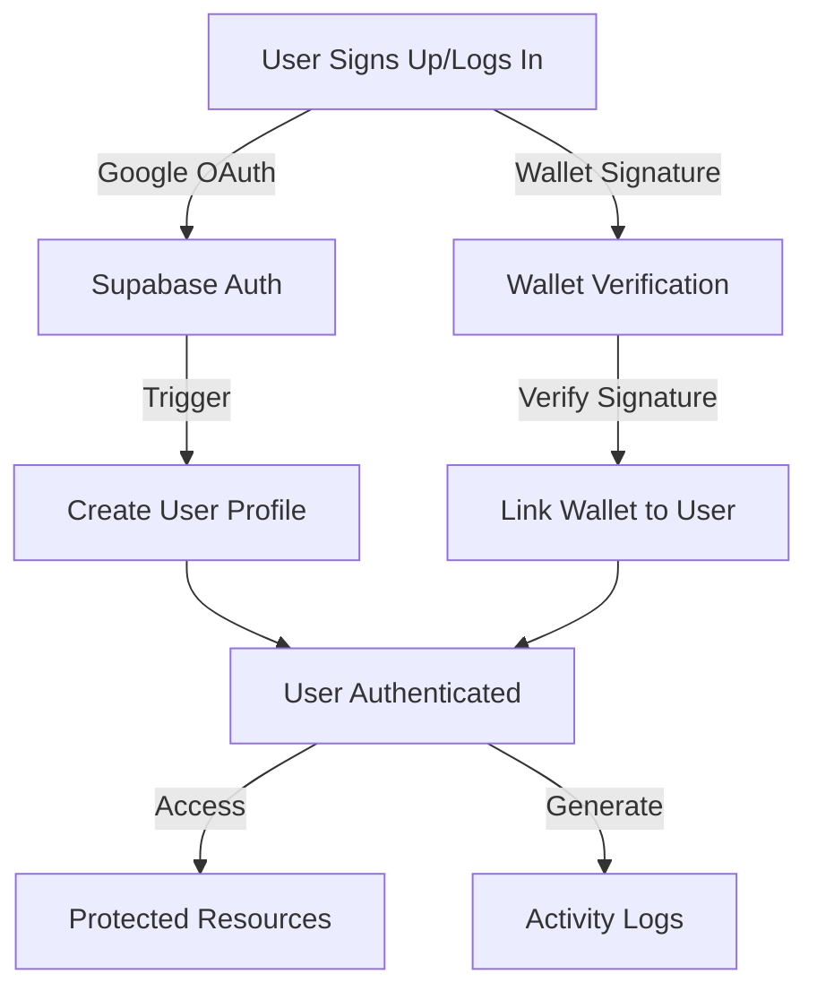
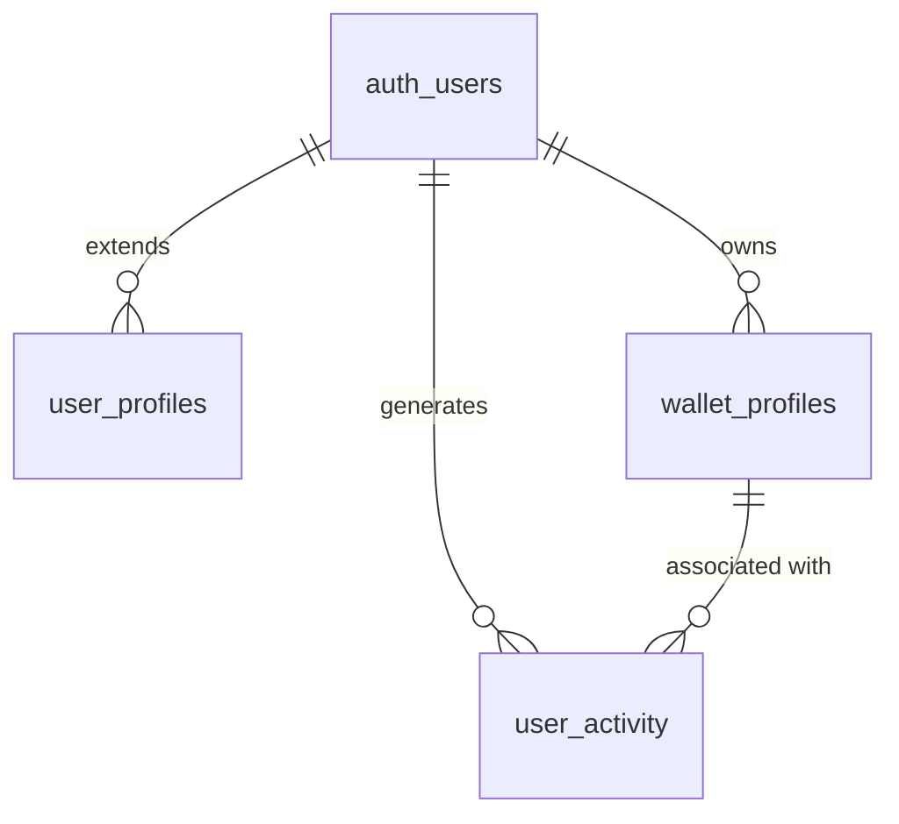
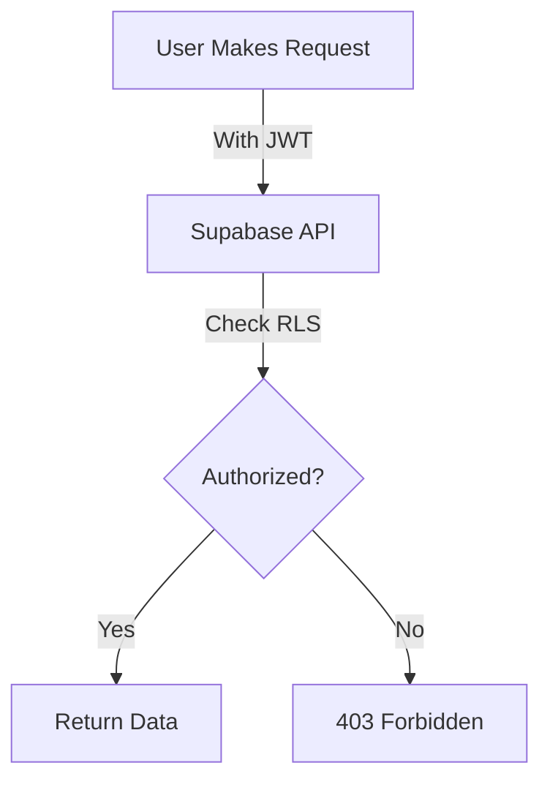

# Wallet Whisperer Supabase Authentication Flow

## User Authentication Flow

## Database Relationships

## Authentication Methods

1. **Google OAuth Flow**:
   - User initiates Google login
   - Supabase handles OAuth redirect and token exchange
   - User is created in `auth.users` table
   - Trigger automatically creates entry in `user_profiles`
   - User is authenticated with JWT

2. **Wallet Signature Flow**:
   - User connects wallet (MetaMask)
   - Backend generates message for signing
   - User signs message with wallet
   - Backend verifies signature
   - Wallet is linked to user in `wallet_profiles`
   - User is authenticated

## Row Level Security (RLS) Flow

## Data Access Patterns

1. **User Profile Access**:
   - Users can only view/edit their own profile
   - RLS policy: `auth.uid() = id`

2. **Wallet Profiles Access**:
   - Users can only view/manage their own wallet connections
   - RLS policy: `auth.uid() = user_id`

3. **Activity Logging**:
   - Anyone can insert activity logs (for anonymous tracking)
   - Users can only view their own activity logs
   - RLS policy for select: `auth.uid() = user_id`
   - RLS policy for insert: `true`

## Trigger Workflow

When a new user signs up through Supabase Auth:

1. User is created in `auth.users` table
2. `on_auth_user_created` trigger fires
3. `handle_new_user()` function executes
4. New record is created in `user_profiles` with user metadata
5. User now has a complete profile ready for use

## Wallet Linking Process

1. User authenticates (Google OAuth)
2. User connects wallet and signs verification message
3. Backend verifies signature
4. New wallet profile is created in `wallet_profiles` table
5. Wallet is now linked to user account

## Activity Logging Flow

1. User performs action in application
2. Activity is logged to `user_activity` table
3. Logs include user_id, wallet_address (if applicable), and activity details
4. Logs are queryable for analytics and user history
